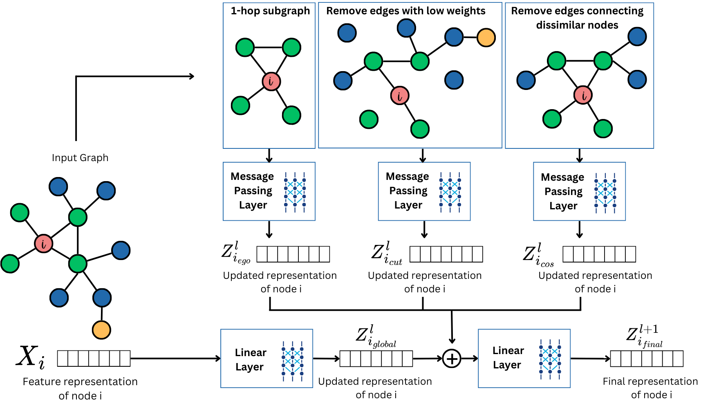

# SAGNN_CS__A_Resilient_Graph_Neural_Network_Framework_Against_Backdoor_Threats

This repository contains the implementation and analysis of Backdoor attacks on Graph Neural Networks both Traditional (GCN, GraphSage and GAT) and Higher Order Graph Neural Network (ESAN, SUN and SAGNN) and a new model SAGNN+CS. 

<p align="center">
  
</p>

# Project Setup and Installation

This project uses a `requirements.txt` file to list all the Python packages (and their specific versions) that the project depends on. Follow the steps below to set up your environment and install the required dependencies.

## Step 1: Open a Terminal or Command Prompt

Navigate to your project directory containing the `requirements.txt` file.

## Step 2: Create and Activate a Virtual Environment

It is a good practice to create a virtual environment so that the packages you install do not interfere with system-wide packages.

### Creating a Virtual Environment

Run the following command to create a virtual environment (using `venv`):

```bash
python -m venv venv
```

### Activating the Virtual Environment

- **On Windows:**

  ```bash
  venv\Scripts\activate
  ```

- **On macOS/Linux:**

  ```bash
  source venv/bin/activate
  ```

## Step 3: Install Dependencies Using pip

With your virtual environment activated (or in your global environment), run the following command:

```bash
pip install -r requirements.txt
```

This command tells pip to read the `requirements.txt` file and install all the listed packages.

## Step 4: Verify Installation

To verify that a package is installed correctly, you can run:

```bash
python -c "import torch; print(torch.__version__)"
```

This should print the installed version of PyTorch.

## Using an IDE

If you're using an IDE such as VS Code, you can use its integrated terminal to run these commands.

```
use python main.py to run all the models.
You can also specify the model which you want the results for by writing python main.py model_type (example: sagnn+cs or sagn or sun or esan or gnn).

```

## References 

```bibtex
@inproceedings{dhali2024power,
  title={The Power of Many: Investigating Defense Mechanisms for Resilient Graph Neural Networks},
  author={Dhali, Abhijeet and Dividino, Renata},
  booktitle={2024 IEEE International Conference on Big Data (BigData)},
  pages={3572--3578},
  year={2024},
  organization={IEEE}
}

@inproceedings{bevilacqua2022equivariant,
  title={Equivariant Subgraph Aggregation Networks},
  author={Beatrice Bevilacqua and Fabrizio Frasca and Derek Lim and Balasubramaniam Srinivasan and Chen Cai and Gopinath Balamurugan and Michael M. Bronstein and Haggai Maron},
  booktitle={International Conference on Learning Representations},
  year={2022},
}

@article{frasca2022understanding,
  title={Understanding and extending subgraph gnns by rethinking their symmetries},
  author={Frasca, Fabrizio and Bevilacqua, Beatrice and Bronstein, Michael and Maron, Haggai},
  journal={Advances in Neural Information Processing Systems},
  volume={35},
  pages={31376--31390},
  year={2022}
}

@inproceedings{zeng2023substructure,
  title={Substructure aware graph neural networks},
  author={Zeng, Dingyi and Liu, Wanlong and Chen, Wenyu and Zhou, Li and Zhang, Malu and Qu, Hong},
  booktitle={Proceedings of the AAAI conference on artificial intelligence},
  volume={37},
  number={9},
  pages={11129--11137},
  year={2023}
}

@inproceedings{kipf2017semi,
  title={Semi-Supervised Classification with Graph Convolutional Networks},
  author={Kipf, Thomas N and Welling, Max},
  booktitle={International Conference on Learning Representations},
  year={2017}
}

@inproceedings{velivckovic2018graph,
  title={Graph Attention Networks},
  author={Veli{\v{c}}kovi{\'c}, Petar and Cucurull, Guillem and Casanova, Arantxa and Romero, Adriana and Li{\`o}, Pietro and Bengio, Yoshua},
  booktitle={International Conference on Learning Representations},
  year={2018}
}

@inproceedings{hamilton2017inductive,
  title={Inductive Representation Learning on Large Graphs},
  author={Hamilton, William L and Ying, Rex and Leskovec, Jure},
  booktitle={Advances in Neural Information Processing Systems},
  year={2017}
}


@inproceedings{zhang2021backdoor,
  title={Backdoor attacks to graph neural networks},
  author={Zhang, Zaixi and Jia, Jinyuan and Wang, Binghui and Gong, Neil Zhenqiang},
  booktitle={Proceedings of the 26th ACM Symposium on Access Control Models and Technologies},
  pages={15--26},
  year={2021}
}


@inproceedings{xi2021graph,
  title={Graph backdoor},
  author={Xi, Zhaohan and Pang, Ren and Ji, Shouling and Wang, Ting},
  booktitle={30th USENIX Security Symposium},
  pages={1523--1540},
  year={2021}
}

@inproceedings{dai2023unnoticeable,
  title={Unnoticeable backdoor attacks on graph neural networks},
  author={Dai, Enyan and Lin, Minhua and Zhang, Xiang and Wang, Suhang},
  booktitle={Proceedings of the ACM Web Conference 2023},
  pages={2263--2273},
  year={2023}
}


@inproceedings{zhang2024rethinking,
  title={Rethinking graph backdoor attacks: A distribution-preserving perspective},
  author={Zhang, Zhiwei and Lin, Minhua and Dai, Enyan and Wang, Suhang},
  booktitle={Proceedings of the 30th ACM SIGKDD Conference on Knowledge Discovery and Data Mining},
  pages={4386--4397},
  year={2024}
}
